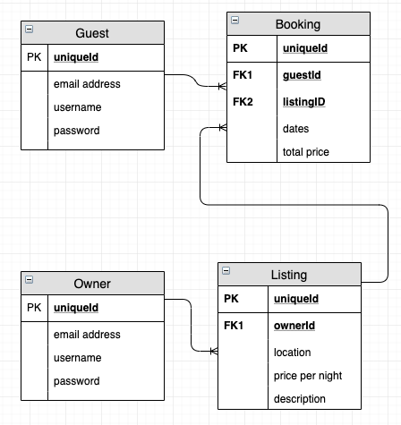

Specification

# Headline specifications

    Any signed-up user can list a new space.
    Users can list multiple spaces.
    Users should be able to name their space, provide a short description of the space, and a price per night.
    Users should be able to offer a range of dates where their space is available.
    Any signed-up user can request to hire any space for one night, and this should be approved by the user that owns that space.
    Nights for which a space has already been booked should not be available for users to book that space.
    Until a user has confirmed a booking request, that space can still be booked for that night.

# Nice-to-haves

    Users should receive an email whenever one of the following happens:
    They sign up
    They create a space
    They update a space
    A user requests to book their space
    They confirm a request
    They request to book a space
    Their request to book a space is confirmed
    Their request to book a space is denied
    Users should receive a text message to a provided number whenever one of the following happens:
    A user requests to book their space
    Their request to book a space is confirmed
    Their request to book a space is denied
    A ‘chat’ functionality once a space has been booked, allowing users whose space-booking request has been confirmed to chat with the user that owns that space
    Basic payment implementation though Stripe.

# Planning

## User stories for Minimum Viable Product:

### Adding Properties:  
> As a property owner.  
> So that I can rent my property out  
> I want to be able to add my property details   
> and my contact details.

### Viewing Properties
> As a holiday maker,   
> so that I can choose which property to rent  
> I want to be able to see a list of properties  
> with property details and owner contact information.

## To add after MVP

### User stories - Landlord
> As a landlord.  
> so that I can control my listing  
> I want to have an account on the system which identifies me.
 
> As a landlord.  
> so that I can get bookings  
> I want to be able to add a listing.
 
> As a landlord.  
> so I can organise my diary  
> I want to be able to view a list of bookings.

### User Stories - Guest 
> As a guest  
> so that I can make bookings.  
> I want to have an account on the system which identifies me.

> As a guest  
> so that I can choose a place to stay.  
> I want to be able to view the listings.

> As a guest  
> so that I can reserve a place to stay.   
> I want to be able to make a booking. 

> As a guest  
> so that I can check my itinerary.   
> I want to be able to view a list of my bookings. 
